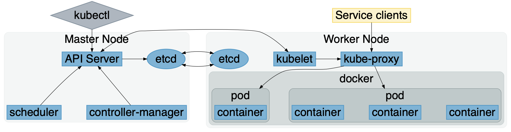

# Introduction to Kubernetes

Janne Pelkonen, CTO, IdeaNova Technologies, Inc.

- Quick introduction to Kubernetes
- Overview of IdeaNova use cases and experiences
- Demo
  - Creating a sample application and a local cluster
  - Deploying, running and scaling the sample
- Presentation and demo is available on Github

==

## Kubernetes Overview

- Open Source system for deploying, scaling and managing containerized applications
  - "Operating System" for distributed applications
- Developed by Google
  - Conceptually based on internal systems (Borg/Omega)
  - Released in 2014
  - 1.0 release in 2015
- Vendor neutral, managed by CNCF

==

## Kubernetes Architecture

==

## Demo

- Create app
- Deploy app
- Create a service
- Setup console
- Scale an app

==

## Our experience @IdeaNova

- Long time user of docker containers
  - Distributed as containers
  - Often pre-configured to work together with Docker compose
- Considerations for our cloud platform
  - Vendor independence (+)
  - Industry momentum (+)
  - Additional cost and complexity (-)
==

## Case study: Cloud Packager

- Used to DRM encrypt and package video content
  - Based on our battle-tested packaging technology
- Runs on AWS
- Main flow
  1. Content is copied to S3 inbound bucket
  2. λ-function is creates a Job in K8S cluster
  3. Packager pod
      1. Copies the content from S3 bucket
      2. Runs the packager
      3. Copies the output to an outbound S3 bucket

==

## Experiences

- We used Amazon EKS
  - AWS managed master
  - Worker nodes are your responsibility
- Set up is non-trivial
  - We used terraform to setup our cluster
- Setting up networking can be difficult
  - Multiple networking layers (AWS, VPC etc.)
  - Try to keep things simple

==

## Experiences (cont'd)

- AWS provides AMIs for worker nodes
  - Early images (mid-2018) had issues
  - Upgrades were not always compatible
- Kubernetes itself performed as expected
- Local testing/debugging is a win

==

## Discussion
